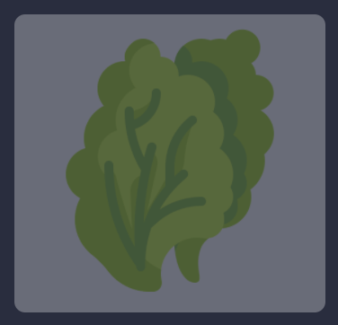
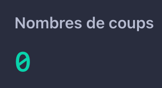
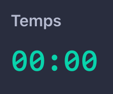
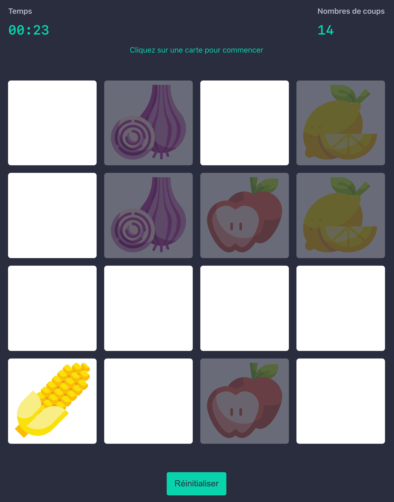

<h1 align="center">OptiSantis - Test React</h1>

- [Introduction](#introduction)
  - [Déroulement](#déroulement)
- [1. Créer une grille Memory](#1-créer-une-grille-memory)
  - [🎯 Objectifs](#-objectifs)
  - [📝 Notes](#-notes)
  - [👨‍💻 Exercice](#-exercice)
  - [🎉 Final](#-final)
- [2. Gestion des états](#2-gestion-des-états)
  - [🎯 Objectifs](#-objectifs-1)
  - [👨‍💻 Exercice](#-exercice-1)
    - [États des cartes](#états-des-cartes)
    - [Compteur de coups](#compteur-de-coups)
    - [Statut du jeu](#statut-du-jeu)
    - [Timer](#timer)
  - [🎉 Final](#-final-1)
- [3. Typescript](#3-typescript)
  - [🎯 Objectifs](#-objectifs-2)
  - [🔗 Ressources](#-ressources)
  - [👨‍💻 Exercice](#-exercice-2)
- [4. Testing](#4-testing)
  - [🎯 Objectifs](#-objectifs-3)
  - [🔗 Ressources](#-ressources-1)
  - [👨‍💻 Exercice](#-exercice-3)
- [Remarques](#remarques)

---

## Introduction

Dans ce test votre but sera de créer un jeu [Memory](https://fr.wikipedia.org/wiki/Memory_(jeu)) en utilisant le plus de concept possible de React, tout en gardant une cohérence dans l'utilisation de ces concepts. 

Ce test est séparé en 5 sections, vous n'êtes pas obligé de toutes les réalisées, mais il est fortement conseillé de réaliser au minimum les sections 1, 2 et 5.

Tous les fichiers de configuration ont déjà été créés pour vous permettre de vous concentrer sur le code, si vous avez des problèmes veuillez vous référer à la [documentation de create-react-app](https://create-react-app.dev/docs/troubleshooting).

Pour lancer le test dans votre navigateur il vous suffit de lancer `yarn start` ou `npm start` dans votre terminal. [Voir la documentation create-react-app](https://create-react-app.dev/docs/getting-started).

En bonne pratique nous vous conseillons de créer un `commit` ou `tag` à chaque fin de section.

### Déroulement

1. Clonner le dépôt git
2. Créer une branche pour votre test comme suit `test/{votre-nom}`
3. Une fois terminé, créer une PR sur la branche `master`
4. Nous reviendrons vers vous pour les remarques dans un entretien individuel

---

## 1. Créer une grille Memory

### 🎯 Objectifs

Tester vos connaissances d'intégration (sémantique HTML, accéssibilité, css) et les concepts de bases de React.

### 📝 Notes

Aucunes libraire de composants tiers n'est autorisée pour cette section, tel que _Bootstrap_ ou _Material UI_, vous devrez créer les composants et leurs styles "from scratch".

En interne nous utilisons [`styled-components`](https://styled-components.com), il est donc recommendé d'utiliser cette librairie pour le style des composants. Cependant vous pouvez aussi utiliser une autre librairie ou un autre language (css, sass, postcss, emotion, ...), nous voulons surtout connaitre votre niveau en CSS à travers cet exercice.

### 👨‍💻 Exercice

Cet exercice est un test d'intégration sans gestion des états, à la fin de l'exercice le jeu ne devrait pas fonctionner. Cette étape est importante pour placer les éléments et se concentrer sur la sémantique HTML et le style des composants.

Vous êtes libre de créer autant des dossiers et fichiers que vous considérez nécessaires.

### 🎉 Final

Voici l'intégration finale à réaliser:

---

## 2. Gestion des états

### 🎯 Objectifs

Tester vos connaissances sur les concepts d'états (`state`) d'un composant. Avec l'utilisation d'outils tels que les [`Context`](https://reactjs.org/docs/context.html), [`hooks`](https://reactjs.org/docs/hooks-intro.html) ou même [`Redux`](https://redux.js.org/).

### 👨‍💻 Exercice

#### États des cartes

Les cartes ont _trois_ états :

- `idle`: La carte n'a pas été cliquée, un background uni blanc est visible.
  
  
  
- `active`: La carte a été cliquée, on affiche l'image du fruit.
  
  
  
- `found`: La carte et sa paire ont été trouvées, il n'est plus possible de cliquer sur la carte.
  
  

#### Compteur de coups

Lorsque **deux** cartes sont retournées le compteur de coups doit augmenté de `1`.

#### Statut du jeu

_Trois_ états du jeu sont disponibles:

- `new`: tous les états sont réinitialisés, le timer doit afficher: `00:00`, le compteur de coups: `0` et toutes les cartes doivent être `idle`.
  
  Au clique du bouton `réinitialiser`, l'état  du jeu doit passer à `new`.

- `running`: le timer doit être lancé, les coups doivent être comptabilisés.
  
  Au clique d'une carte `idle`, l'état  du jeu doit passer à `running`.

- `finish`: le timer est arrété et les coups sur les cartes ne sont plus comptabilisés.

  Lorsque toutes les cartes ont un état `found`, l'état  du jeu doit passer à `finish`.

#### Timer

Le timer commence lorsque l'on clique sur une carte `idle` et que l'état du jeu est `new`.
Il s'arrête une fois que l'état du jeu est à `finish`.

### 🎉 Final

Voici un exemple de jeu en cours:

---

## 3. Typescript

### 🎯 Objectifs

Cet exercice nous permet de connaitre votre niveau sur Typescript.

### 🔗 Ressources

- https://www.typescriptlang.org/
- https://create-react-app.dev/docs/adding-typescript/

### 👨‍💻 Exercice

Vous devez installer typescript, soit manuellement, soit grâce à [create-react-app](https://create-react-app.dev/docs/adding-typescript/).

Une fois typescript installé, vous devez modifier vos fichiers en `.ts` ou `.tsx`, pour ensuite créer et utiliser les types dans vos composants.

> 🚨 Il est possible que la version de typescript installé localement, rentre en conflit avec celle installée sur votre IDE par défaut;
>
> Sur vscode par exemple il vous faudra changer la version pour utiliser celle de votre `workspace`. Pour ce faire il faut aller dans un fichier `.ts` ou `.tsx`, ensuite faire la combinaise clavier `cmd`+`shfit`+`p`, puis taper `TypeScript: Select TypeScript Version...`, et enfin sélectionner la version `Workspace` ou une version supérieure à `4.1.x`.

L'exercice est considéré comme réalisé, une fois qu'il n'y a plus d'erreur typescript sur votre IDE et/ou lors de la compilation de développement.

---

## 4. Testing

### 🎯 Objectifs

Cet exercice nous permet de connaitre votre niveau sur les tests unitaires.

### 🔗 Ressources

- [CRA - Running Tests](https://create-react-app.dev/docs/running-tests)
- [Jest](https://jestjs.io/)
- [Testing Library](https://testing-library.com/docs/)

### 👨‍💻 Exercice

Vous devez créer au moins un test pour un composant, de préférence le composant principal de votre application.

Si vous n'avez jamais créé ou utilisé de tests, nous vous recommendons de regarder [la documentation de create-react-app](https://create-react-app.dev/docs/running-tests).

Pour lancer un test il suffit de lancer `yarn test` dans votre terminal.

---

## Remarques

Cette section n'est pas un exercice, si vous avez des remarques sur le tests ou sur le code que vous avez écrit, nous vous recommandons de les ajouter lors de votre pull request.

Si vous n'avez pas eu le temps de faire toutes les sections ou juste en parties, nous vous conseillons d'ajouter quelques lignes pour nous expliquer pourquoi.

En espérant que l'exercice vous aura plut, avec un peu de chance appris de nouveaux concepts.
